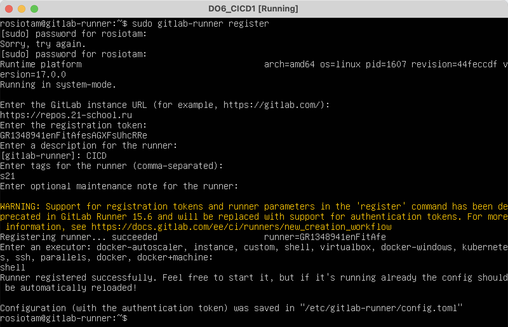
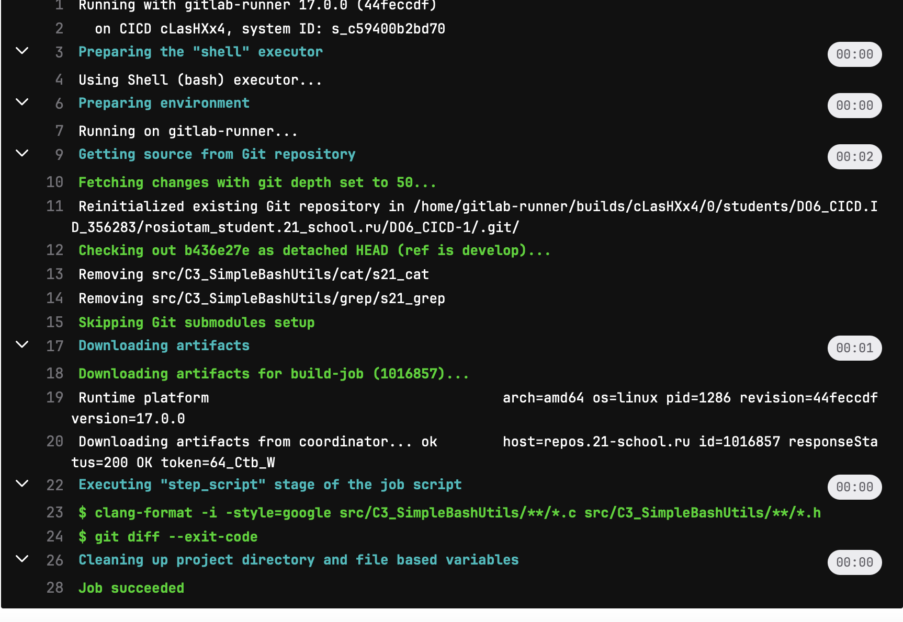
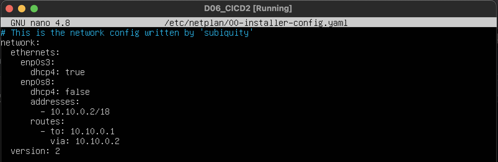

### Part 1. Setting up the **gitlab-runner**

**== Task ==**

##### Start *Ubuntu Server 22.04 LTS* virtual machine.

##### Download and install **gitlab-runner** on the virtual machine.

Download:

Install:

Register:

### Part 2. Building

**== Task ==**

#### Write a stage for **CI** to build applications from the *C2_SimpleBashUtils* project.

##### In the _gitlab-ci.yml_ file, add a stage to start the building via makefile from the _C2_ project.

Install packages on Ubuntu:

- sudo apt install make
- sudo apt install gcc
- sudo apt install clang-format

Write .gitlab-ci.yml with "stage: build":

Launch on Ubuntu gitlab-runner `gitlab-runner run`:

After push project to our repository check `CI/CD -> Piplines` 

success

or error

### Part 3. Codestyle test

#### Write a stage for **CI** that runs a codestyle script (*clang-format*).

##### If the codefile didn't pass, "fail" the pipeline.

### Part 4. Integration tests

#### Write a stage for **CI** that runs your integration tests from the same project.

##### Run this stage automatically only if the build and codestyle test passes successfully.

##### If tests didn't pass, "fail" the pipeline.

##### In the pipeline, display the output of the succeeded / failed integration tests.

### Part 5. Deployment stage

##### Start the second virtual machine *Ubuntu Server 22.04 LTS*.

- create a 2nd VM
- configure and rewrite netplan *.yaml file for both VM
    - 1st:
    
    - 2nd:
    

#### Write a stage for **CD** that "deploys" the project on another virtual machine:

##### Write a bash script which copies the files received after the building (artifacts) into the */usr/local/bin* directory of the second virtual machine using **ssh** and **scp** `src/deploy.sh`

- provide to 1st VM access to connect to 2nd VM via ssh
    - switch to user gitlab-runner `sudo su gitlab-runner`
    - create ssh key `ssh-keygen -t rsa -b 2048`
    - establish ssh connection `ssh-copy-id rosiotam@10.10.0.2`
- give the rights to user rosiotam on the 2nd VM where we copy files `chown rosiotam /usr/local/bin`    

As a result, you should have applications from the *C2_SimpleBashUtils* (s21_cat and s21_grep) project ready to run on the second virtual machine.

##### Save dumps of virtual machine images.

### Part 6. Bonus. Notifications

##### Set up notifications of successful/unsuccessful pipeline execution via bot named "[your nickname] DO6 CI/CD" in *Telegram*.
- The text of the notification must contain information on the successful passing of both **CI** and **CD** stages.

- create the new bot in Telegram using BotFather:

- create script `notification.sh` using the bot's token and telegram profile id

add to every job in .gitlab-ci.yml:

